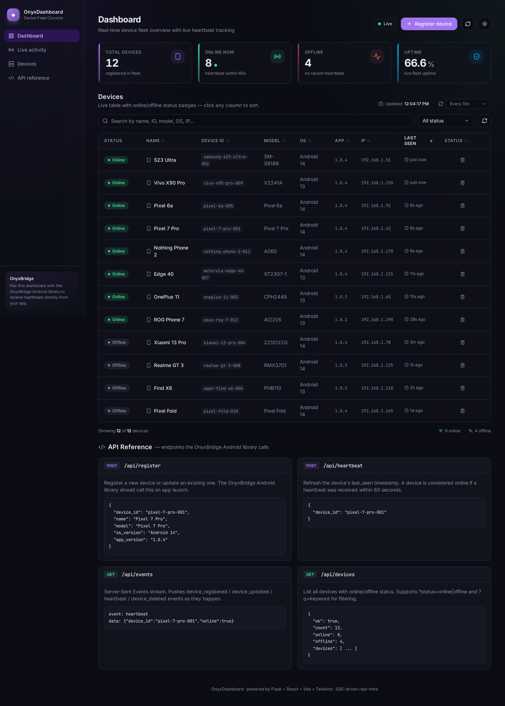

# OnyxDashboard

A clean, dark-themed Python web dashboard for managing Android devices registered from the
[OnyxBridge](https://github.com/arpitrajjj/OnyxBridge) native library. Built with Flask +
SQLite on the backend, and a modern React + TypeScript + Vite + Tailwind + shadcn/ui frontend
with **Server-Sent Events (SSE)** for real-time updates.



## Features

### Real-time (SSE)
- **Server-Sent Events** — `/api/events` pushes `device_registered`, `device_updated`,
  `heartbeat`, and `device_deleted` events the instant they happen.
- **Live indicator** — a pulsing badge in the top bar shows SSE connection state
  (`Live`, `Connecting`, `Polling`, `Disconnected`).
- **Instant UI updates** — when a device heartbeats, its row re-renders immediately with
  no polling or page refresh.
- **Auto-refresh fallback** — if SSE is unavailable (Render cold-start, network blip),
  the UI falls back to polling `/api/devices` on the configured interval.

### Frontend
- **React 18 + TypeScript + Vite** — strict types, fast HMR, modern ESM.
- **shadcn/ui + Tailwind CSS** — clean, accessible, themeable primitives.
- **Lucide icons + Framer Motion** — animated transitions, count-up stats, pulse rings.
- **Dark + Light theme** — toggle in the top bar, persisted to localStorage.
- **Animated stat cards** — total devices, online (with pulse), offline, live uptime %.
- **Sortable device table** — click any column header to sort; status badges with pulse
  for online; relative timestamps; inline delete with toast confirmation.
- **Search + filter** — full-text search across name, ID, model, OS, app version, IP;
  status filter dropdown (online / offline / all).
- **Loading skeletons** — shimmer placeholders while the first fetch is in flight.
- **Auto-refresh toggle** — choose Manual / 5s / 10s / 30s polling intervals.
- **Last-updated timestamp** — always know when the dashboard last synced.
- **Glass-morphism + gradient accents** — premium Vercel/Railway-inspired aesthetic.

### Backend
- **Flask + SQLite (WAL mode)** — tiny, fast, no external DB needed.
- **Device registration** — `POST /api/register` upserts on `device_id`.
- **Heartbeat tracking** — `POST /api/heartbeat` refreshes `last_seen`; online if within 60s.
- **SSE pub/sub** — in-memory `queue.Queue` per client; events fanned out on writes.
- **CORS** — configurable via `ONYX_CORS_ORIGINS`; defaults to `*`.
- **SPA hosting** — Flask serves the built React bundle from `static/dist/`.

## API Reference

| Method | Endpoint | Description |
|--------|----------|-------------|
| `POST` | `/api/register` | Register or update a device. Body: `device_id`, `name`, `model`, `os_version`, `app_version`. |
| `POST` | `/api/heartbeat` | Refresh the device's `last_seen` timestamp. Body: `device_id`. |
| `GET`  | `/api/events` | Server-Sent Events stream — pushes `device_registered`, `device_updated`, `heartbeat`, `device_deleted` events as they happen. |
| `GET`  | `/api/devices` | List all devices with online/offline status. Supports `?status=online|offline` and `?q=keyword`. |
| `DELETE` | `/api/devices/{device_id}` | Remove a device from the fleet. |
| `GET`  | `/healthz` | Liveness probe. |

### Example: register from Android (OkHttp)

```kotlin
val body = """{"device_id":"pixel-7-001","name":"Pixel 7","model":"Pixel 7","os_version":"Android 14","app_version":"1.0.4"}"""
val req = Request.Builder()
    .url("https://onyxdash.example.com/api/register")
    .post(body.toRequestBody("application/json".toMediaType()))
    .build()
httpClient.newCall(req).execute()
```

### Example: heartbeat (Android foreground service)

```kotlin
// Call every 30 seconds while the app is in the foreground
val req = Request.Builder()
    .url("https://onyxdash.example.com/api/heartbeat")
    .post("""{"device_id":"pixel-7-001"}""".toRequestBody("application/json".toMediaType()))
    .build()
httpClient.newCall(req).execute()
```

### Example: subscribe to SSE (browser EventSource)

```ts
const src = new EventSource("/api/events");
src.addEventListener("hello",        (e) => console.log("connected", JSON.parse(e.data)));
src.addEventListener("heartbeat",   (e) => console.log("device updated", JSON.parse(e.data)));
src.addEventListener("device_registered", (e) => console.log("new device", JSON.parse(e.data)));
src.addEventListener("device_deleted",    (e) => console.log("device gone", JSON.parse(e.data)));
```

## Run locally

```bash
# 1. Backend
python -m venv .venv && source .venv/bin/activate
pip install -r requirements.txt
python app.py         # serves API on :5000 with 12 seeded demo devices

# 2. Frontend (separate terminal)
cd frontend
npm install
npm run dev          # Vite dev server on :5173, proxies /api → :5000
```

Open http://localhost:5173 — the dashboard hot-reloads on save. The Flask
backend auto-seeds 12 sample devices on first launch so the dashboard isn't
blank during your first visit.

To build the frontend for production (output goes to `static/dist/`):

```bash
cd frontend && npm run build
# Now Flask serves the SPA at http://localhost:5000/
```

## Run with Docker

```bash
docker compose up --build -d
# open http://localhost:5000
```

The Dockerfile is multi-stage: stage 1 builds the React bundle with Node 20,
stage 2 runs gunicorn with `--threads 8` so SSE streams don't block other
requests.

## Deployment (Render)

The repo includes a `render.yaml` that defines a Docker-based web service with:
- 1 GB persistent disk for `/data` (so SQLite survives redeploys)
- `healthCheckPath: /healthz`
- `autoDeploy: true` — every push to `main` triggers a redeploy
- Environment variables: `ONYX_DB_PATH`, `ONYX_HEARTBEAT_TIMEOUT`, `ONYX_CORS_ORIGINS`

To set up from scratch: connect the GitHub repo on Render → New → Web Service →
Blueprint → Render reads `render.yaml` and creates the service.

## Configuration

| Env var | Default | Description |
|---------|---------|-------------|
| `ONYX_DB_PATH` | `onyxdashboard.db` | SQLite database file path. |
| `ONYX_HEARTBEAT_TIMEOUT` | `60` | Seconds since `last_seen` before a device flips to offline. |
| `ONYX_CORS_ORIGINS` | `*` | Comma-separated list of allowed origins for CORS. |
| `PORT` | `5000` | Port the Flask dev server binds (set by Render automatically). |
| `VITE_API_BASE` | `""` | Override the API base URL the frontend uses (defaults to same-origin). |

## CI

GitHub Actions (`.github/workflows/ci.yml`) on every push / PR:

1. Set up Python 3.12 + Node 20
2. Install Python + frontend deps
3. TypeScript typecheck
4. `vite build` the frontend → `static/dist/`
5. Run `pytest` (19 tests, including SSE pub/sub + CORS)
6. Smoke test: boots Flask, probes `/healthz`, `/api/devices`, `/`, `/api/events`
7. `docker build` with buildx layer caching
8. Container smoke test — runs the image, curls `/healthz` and `/`

## Project layout

```
OnyxDashboard/
├── app.py                          # Flask + SQLite + SSE + SPA hosting
├── requirements.txt
├── conftest.py / pyproject.toml    # pytest config
├── tests/test_app.py               # 19 backend tests
├── Dockerfile                      # Multi-stage: node build → python runtime
├── docker-compose.yml
├── render.yaml                     # Render blueprint
├── .github/workflows/ci.yml
├── screenshots/                    # Playwright captures
├── templates/dashboard.html        # Legacy fallback (unused when dist exists)
├── static/dist/                    # Vite build output (gitignored, built by CI/Docker)
└── frontend/                       # React + Vite + TS source
    ├── package.json
    ├── vite.config.ts
    ├── tsconfig.json
    ├── tailwind.config.js
    ├── index.html
    ├── public/favicon.svg
    └── src/
        ├── main.tsx / App.tsx
        ├── index.css                # Tailwind + theme tokens
        ├── types.ts
        ├── lib/{api,utils}.ts
        ├── hooks/{useTheme,useSSE,useDevices}.ts
        └── components/
            ├── ui/                  # shadcn primitives
            ├── Sidebar.tsx
            ├── StatGrid.tsx
            ├── DeviceTable.tsx
            ├── LiveIndicator.tsx
            ├── ThemeToggle.tsx
            ├── RefreshControl.tsx
            ├── RegisterDeviceModal.tsx
            ├── AnimatedCounter.tsx
            ├── ApiReference.tsx
            └── Toast.tsx
```

## License

MIT.
